# Project 1

## Overview

## Task 1

To rasterize triangles, we start by first finding the minimum and maximum x and y values of the triangle coordinates. We then iterate through every pixel within these bounds and perform the three line test to determine if we should fill the pixel in with the triangle color. The three line test checks a pixel against each of the three edges of the triangle, and determines that it is inside the triangle if it is on the same side of all three edges. We perform the three line test for both possibilities of triangle coordinate orders: clockwise and counterclockwise.

When we find the min/max x and y values, we are limiting our iteration over pixels to the smallest bounding box that contains the triangle. Thus our algorithm performs the same as one that checks every sample within the bounding box of the triangle.

Below is a visualization of our rasterization of some triangles, with the pixel inspector centered at a triangle corner.

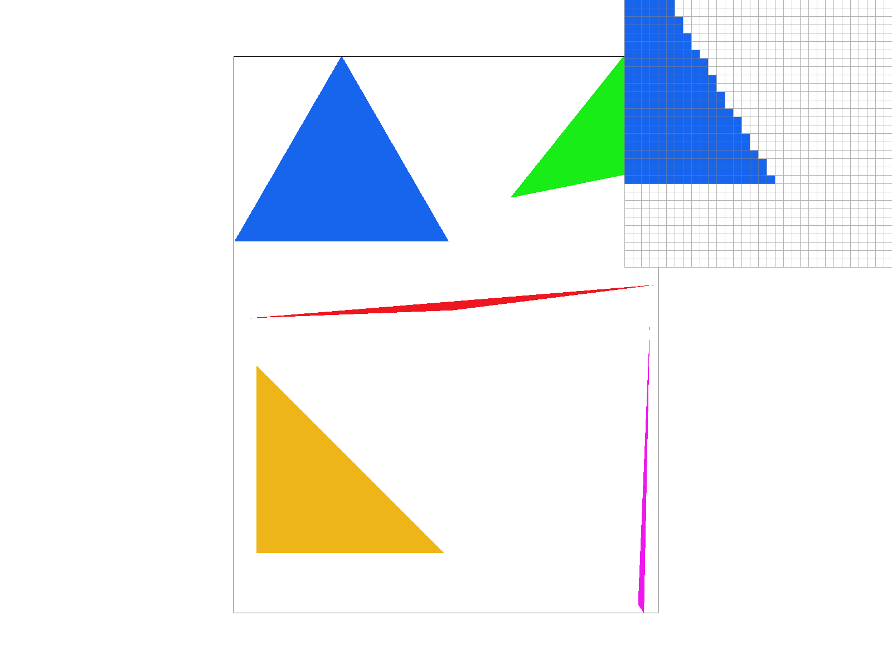

## Task 2

Our supersampling algorithm is pretty straightforward, and we only slightly modify our triangle rasterization method and rasterization pipeline. Instead of looping through the entire image pixel by pixel as described in [Task 1](#task-1) and mapping 1:1 into the framebuffer, we instead increment by a calculated "sample gap" (one over the square root of our sample rate) and map one pixel to multiple pixels within the framebuffer. This basically "enlarges" our image. After we map one pixel to multiple pixels in the framebuffer, we cannot apply this directly to the screen. Thus, when we resolve our framebuffer, we again loop through the "enlarged" image and calculate the color averages of surrounding pixels (e.g. groups of 4 or 16 pixels).

Supersampling is useful it smoothes over harsh pixel borders. It does this by taking multiple color samples are taken inside one pixel, and then calculate an average color value of surrounding pixels. This can get rid of aliasing, e.g. jaggies, and create images that have smoother pixel transitions.

We used this technique to antialias our triangles. For a sample rate of 1, you can see how "jagged" the triangle corners are. There is even a stray red pixel that seems to float away from the triangle! After supersampling, you can see the effects are a lot better. By supersampling a pixel multiple times, and then downsampling by taking an average of 16 pixels for example, the triangle border is a lot more smooth and less "jaggy".

  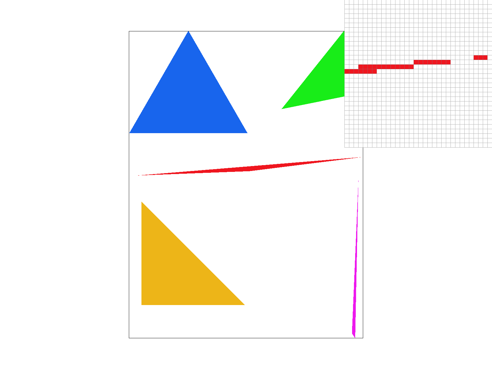
  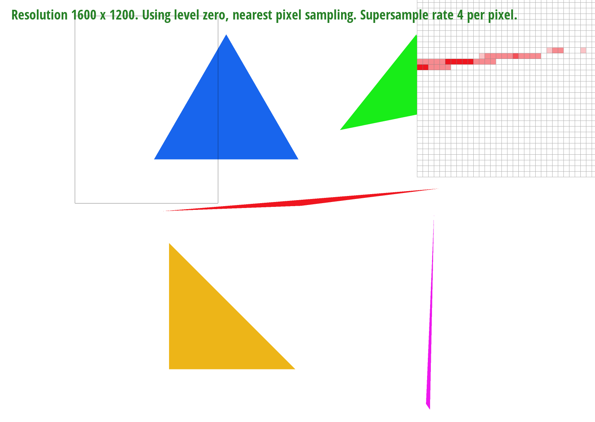 
  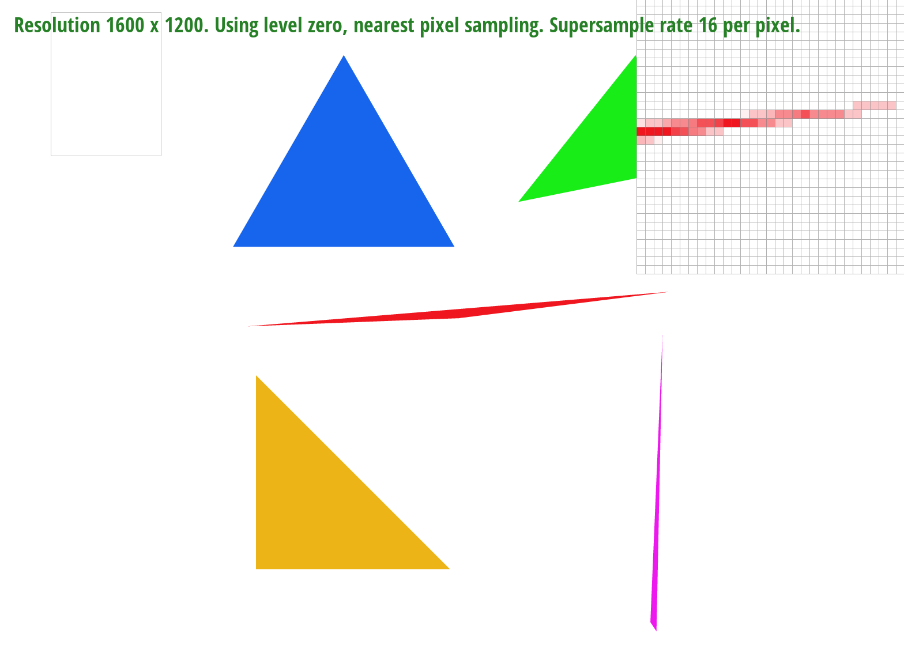

## Task 3

Below is an image of our dancing cubeman doing a pirouette.
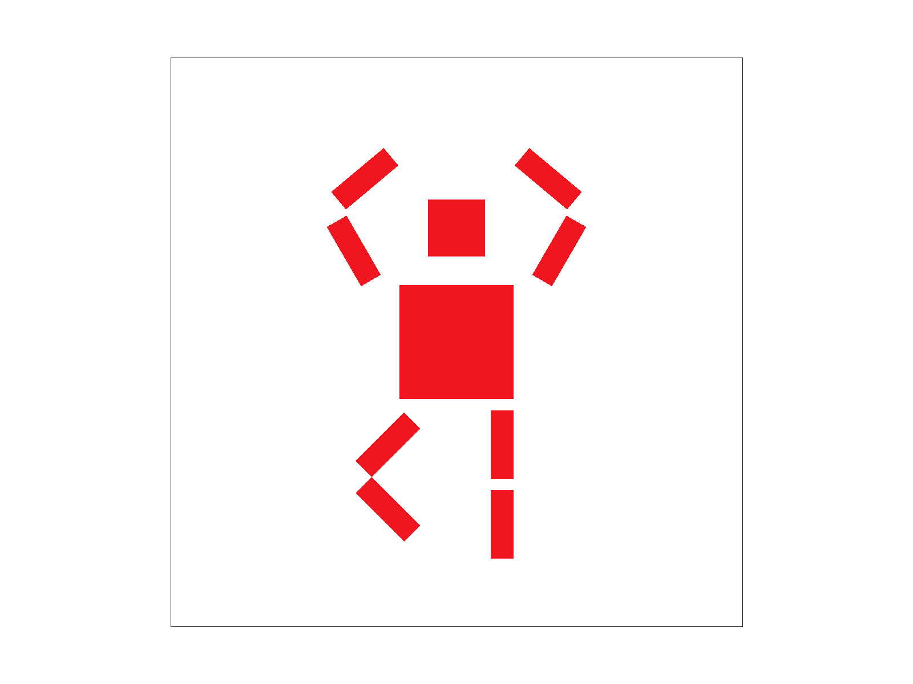

## Task 4

Barycentric coordinates are essentially three scalars (alpha, beta, and gamma) that can determine the position of any point within a triangle by indicating how far/close the point is to a vertex. In the example of a triangle with red, green, and blue vertices, to calculate a color/position in the triangle you would need to calculate the weighted sum of each vertex's color and the three scalars. In the image below, the chosen point's color is closer to the red vertex (A), which would imply that the alpha value would have a greater value than the beta value. 

Here is a png screenshot of svg/basic/test7.svg with default viewing parameters and sample rate 1:

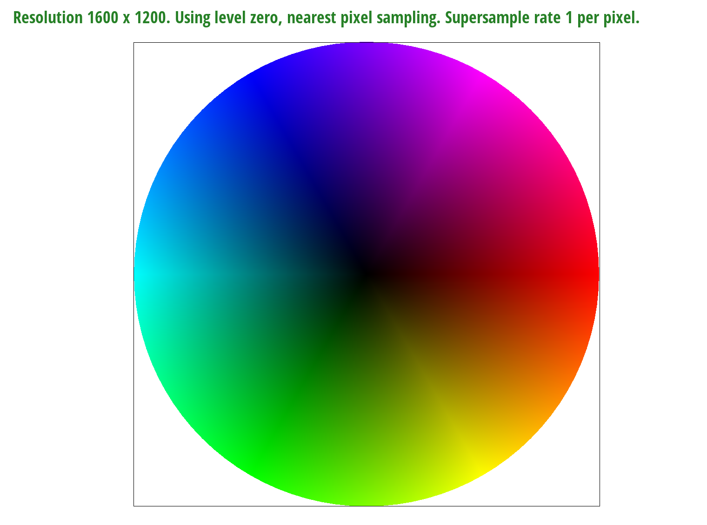

## Task 5

Pixel sampling is where you calculate the color of a pixel using various factors, for example any underlying textures or surrounding pixels. To perform texture mapping, we loop through the entire image and transform the screen coordinate to the corresponding texture space. Then, we use pixel sampling to find the best color for the pixel, either by sampling the nearest pixels or bilinearly.

Nearest pixel sampling is where you sample the nearest pixel from the original image to use in the new image. Bilinear pixel sampling instead samples the four nearest pixels in the original image and essentially takes a weighted average to calculate the pixel color. 

  
  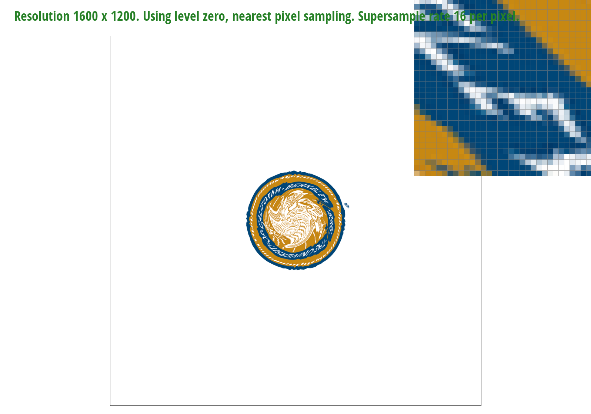 

  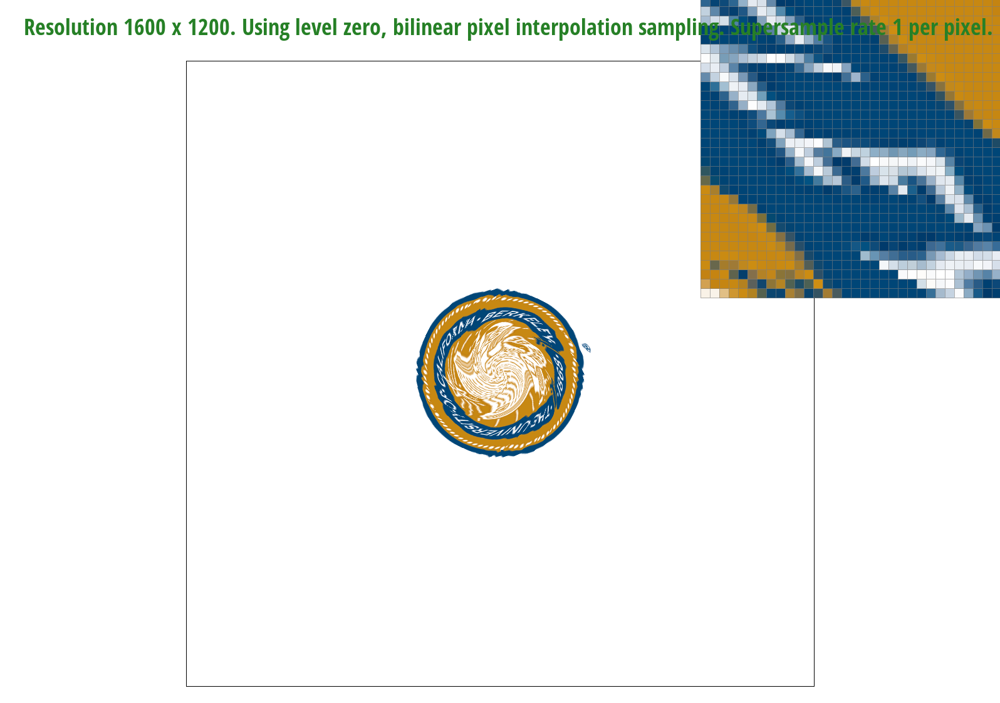
  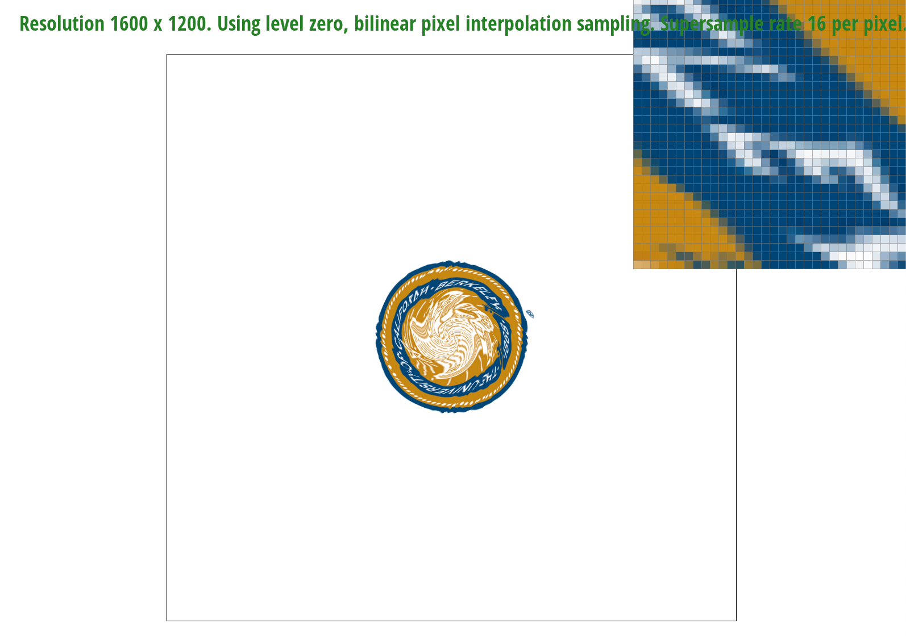 

Comparing the screenshots above, you can see how "jagged" the letters in the nearest pixel sampling at 1 sample per pixel appears. It's not smooth at all, and almost impossible to tell what letters are in the twisted Berkeley seal. This is because we are just taking the nearest pixel value instead of calculating a new one after the texture was applied, which can involve a lot of twisting/turning. Thus, there is a lot of aliasing going on. In some way, supersampling with nearest pixel sampling is able to get rid of some of the aliasing, but there are still some white "bumps" on the letter "E" that makes it look weird. This is because supersampling was done after nearest pixel sampling.

In contrast, bilinear pixel sampling seems to outperform nearest pixel sampling in these examples. At a sample rate of 1, the letters seem a lot more smoothed out. This is because bilinear pixel sampling performs a bilinear interpolation between the pixels in the surrounding area to generate new pixel values. This helps smooth out a lot of the jaggies that appear when applying such a twisty texture. Then, with supersampling, the transition between the background and the letters are a lot more smooth and there's a lot less aliasing. You can even read the letters on the seal.

## Task 6

Level sampling solves the problem of aliasing when we sample textures in areas when each screen pixel has a high footprint in the texture, meaning it covers many texture pixels. The solution is to precompute lower resolution versions of the texture (to varying degrees) to use in these areas, which correspond to the different levels of our mipmap. To implement level sampling for texture mapping, we calculated the appropriate mipmap level to use by looking at how far apart adjacent screen pixels are in the texture space. The more texture pixels they span, the higher of a mipmap level we use.

Pixel sampling is the fastest and uses the least memory out of the sampling methods, but it has the least antialiasing power because we only sample once per pixel that is displayed. In contrast, sampling a fixed number of times per pixel is the slowest and uses the most memory (a factor of the sample rate), but has the best antialiasing power. Using level sampling with a mipmap is a balance between the two of these: since the filtered textures are precomputed, level sampling is faster than supersampling (and slower than pixel sampling), and it only uses 33% additional memory while reducing aliasing.

Below are some images of Kermit, with the pixel inspector centered on his eye to showcase the differences between different sampling methods.
|  | | 
| ----------- | ----------- |
| `L_ZERO` and `P_NEAREST`   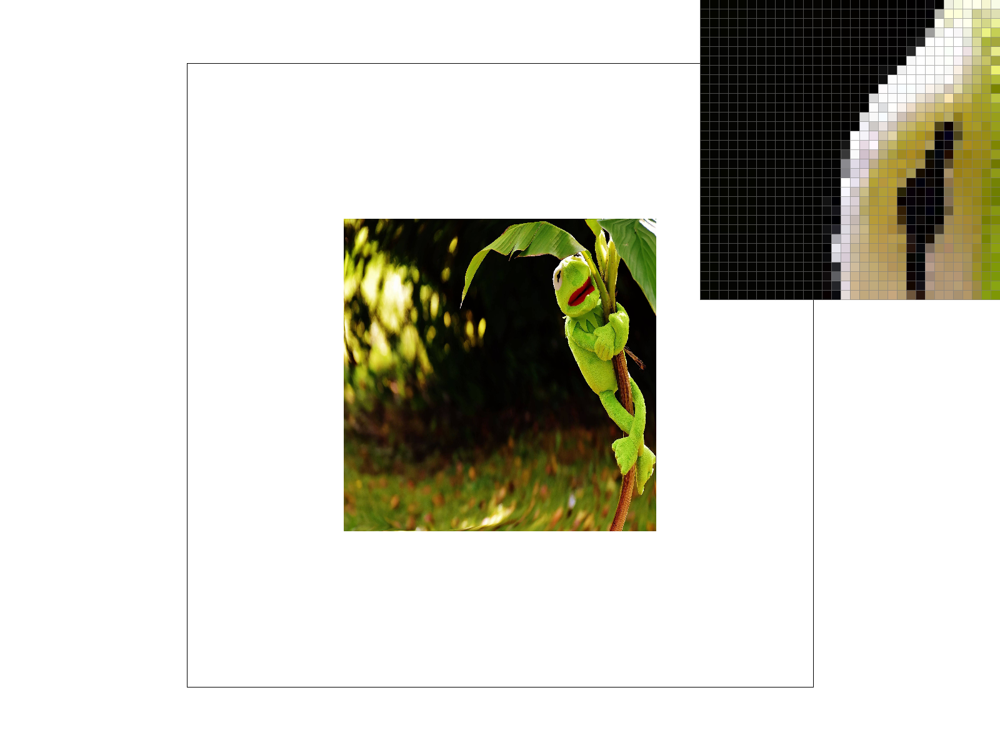 | `L_ZERO` and `P_LINEAR`    |
| `L_NEAREST` and `P_NEAREST`   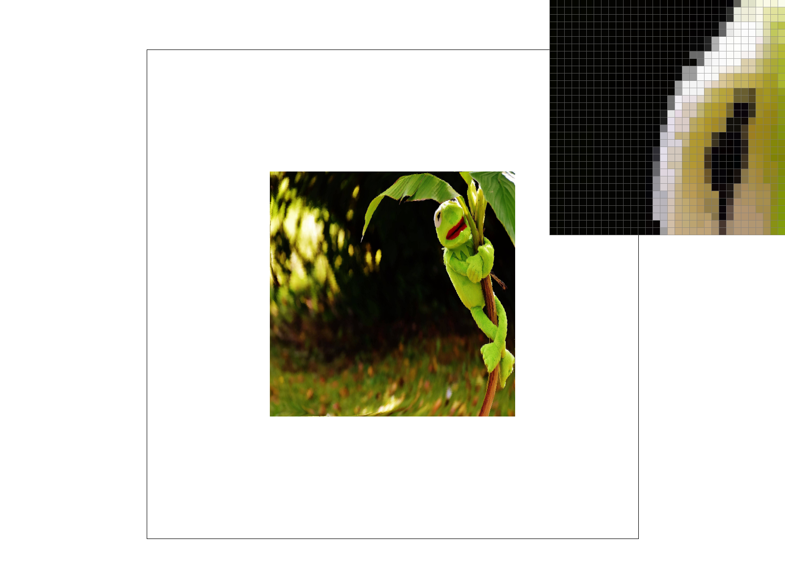 | `L_NEAREST` and `P_LINEAR`    |

https://michelllepan.github.io/cs184-proj-webpage/