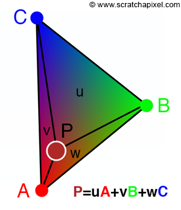

# Project 1

## Overview

## Task 1

To rasterize triangles, we start by first finding the minimum and maximum x and y values of the triangle coordinates. We then iterate through every pixel within these bounds and perform the three line test (as described in lecture) to determine if we should fill the pixel in with the triangle color. We perform the three line test for both possibilities of triangle coordinate orders: clockwise and counterclockwise.

When we find the min/max x and y values, we are limiting our iteration over pixels to the smallest bounding box that contains the triangle. Thus our algorithm performs the same as one that checks every sample within the bounding box of the triangle.

Below is a visualization of our rasterization of some triangles, with the pixel inspector centered at a triangle corner.

## Task 2

Our supersampling algorithm is pretty straightforward, and we only slightly modify our triangle rasterization method and rasterization pipeline. Instead of looping through the entire image pixel by pixel as described in [Task 1](#task-1) and mapping 1:1 into the framebuffer, we instead increment by a calculated "sample gap" (one over the square root of our sample rate) and map one pixel to multiple pixels within the framebuffer. This basically "enlarges" our image. After we map one pixel to multiple pixels in the framebuffer, we cannot apply this directly to the screen. Thus, when we resolve our framebuffer, we again loop through the "enlarged" image and calculate the color averages of surrounding pixels (e.g. groups of 4 or 16 pixels).

Supersampling is useful it smoothes over harsh pixel borders. It does this by taking multiple color samples are taken inside one pixel, and then calculate an average color value of surrounding pixels. This can get rid of aliasing, e.g. jaggies, and create images that have smoother pixel transitions.

We used this technique to antialias our triangles. For a sample rate of 1, you can see how "jagged" the triangle corners are. There is even a stray red pixel that seems to float away from the triangle! After supersampling, you can see the effects are a lot better. By supersampling a pixel multiple times, and then downsampling by taking an average of 16 pixels for example, the triangle border is a lot more smooth and less "jaggy".

  
   
  

## Task 3

Below is an image of our dancing cubeman doing a pirouette.

## Task 4

Barycentric coordinates are essentially three scalars (alpha, beta, and gamma) that can determine the position of any point within a triangle by indicating how far/close the point is to a vertex. In the example of a triangle with red, green, and blue vertices, to calculate a color/position in the triangle you would need to calculate the weighted sum of each vertex's color and the three scalars. In the image below, the chosen point's color is closer to the red vertex (A), which would imply that the alpha value would have a greater value than the beta value. 

Here is a png screenshot of svg/basic/test7.svg with default viewing parameters and sample rate 1:

## Task 5

Pixel sampling is where you calculate the color of a pixel using various factors, for example any underlying textures or surrounding pixels. To perform texture mapping, we loop through the entire image and transform the screen coordinate to the corresponding texture space. Then, we use pixel sampling to find the best color for the pixel, either by sampling nearest pixels or bilinearly.

help

## Task 6