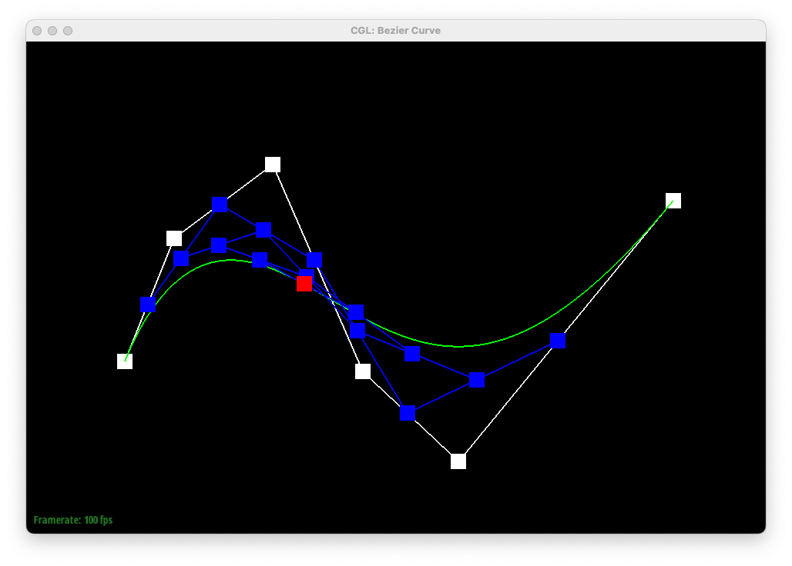

# Project 2

## Overview

In this project, we worked on creating Bezier curves and surfaces, and also implemented various operations on meshes. It was cool to see in practice how we create 3D objects, and how simple triangle meshes can be subdivided to make curved surfaces.

While working on the second half of the project, we found it hugely helpful to plan out and visualize the operations we were implementing. We also learned the importance of thoroughly testing smaller pieces of code before building on top of them. When working on loop subdivision, we discovered bugs in our edge flipping that caused our subdivision to enter infinite loops.

## Task 1

The de Casteljau algorithm repeatedly performs linear interpolations between control points, weighted by a parameter t, to find points on the Bezier curve. Starting with n control points, the algorithm will linearly interpolate consecutive control points to get n-1 intermediate points, then repeat for n-2, n-3, and so on until there is only one point left. The parameter t is used to weight between consecutive points, and adjusting the parameter gives us different points along the curve.

Below are screenshots of a Bezier curve defined by 6 control points at each level of evaluation, followed by the complete curve.

Here is a curve formed by moving some of the control points, at different values of the parameter t.

## Task 2

The de Casteljau algorithm can be extended to Bezier surfaces by finding the single point for every row of control points, and then finding the final point for the surface using all the calculated points. Essentially, you run the algorithm for every row of control points. This will give you a list of new points, which you can run the algorithm on once more to get the final, single point for the nxn surface.

## Task 3

We implemented area-weighted vertex normals by first collecting the neighbors of the vertex, then iterating over them to calculate the normal and area of each adjacent face. We calculated these using the cross product of the face edges, and the norm of the cross product, respectively. Then we summed the unit norms, weighted by the areas, and normalized the final result.

Below is a teapot with default flat shading, and with Phong shading.

## Task 4

For edge flip, we first drew out a simple mesh and labelled all the half-edges, vertices, edges, and faces in the mesh, shown below.

It was an extremely tedious process, but we first defined all the elements shown in the mesh illustration. Then, we reset all the pointers for each of the elements, such as the half-edges (set its next, twin, vertex, face, and edge), vertices, faces, and edges. 

As for debugging, we had a couple of typos that we had to debug through, simply by rereading the code and making sure it matched up with the illustration. 

## Task 5

Similar to edge flip, we also drew out a simple mesh for the operation, shown below.

This time, we had to create new elements (highlighted yellow above). After creating them, we assigned them all their necessary pointers. Similar to edge flip, we reassigned pointers to all elements in the mesh as well.

## Task 6

We implemented loop subdivision by first computing the positions of all the old and new vertices using the original mesh, and storing these positions in the vertex and edge objects. Then, we split every existing edge of the mesh, and then flip all the new edges that connect an old and new vertex. After all the new edges have been created, we update all the vertex positions that we have calculated prior. Implementation-wise, we were just very meticulate with our code and made sure to sanity check every step. We had errors when calculating vertex positions and after stepping through the program, realized we weren't handling floating point numbers well and had to rewrite some calculations.

Here's a cube undergoing loop subdivision:

Sharp corners and edges are usually smoother and lose a lot of detail after undergoing loop subdivision. We can split the cube's edges a bit more to maintain its shape better (although I'm not very good at knowing where to split so it's a bit ooblong), but you can now tell where the cube's faces and edges are.

The cube becomes slightly asymmetric after loop subdivision. We can fix this by splitting all the cube's faces into Xs.

https://michelllepan.github.io/cs184-proj-webpage/