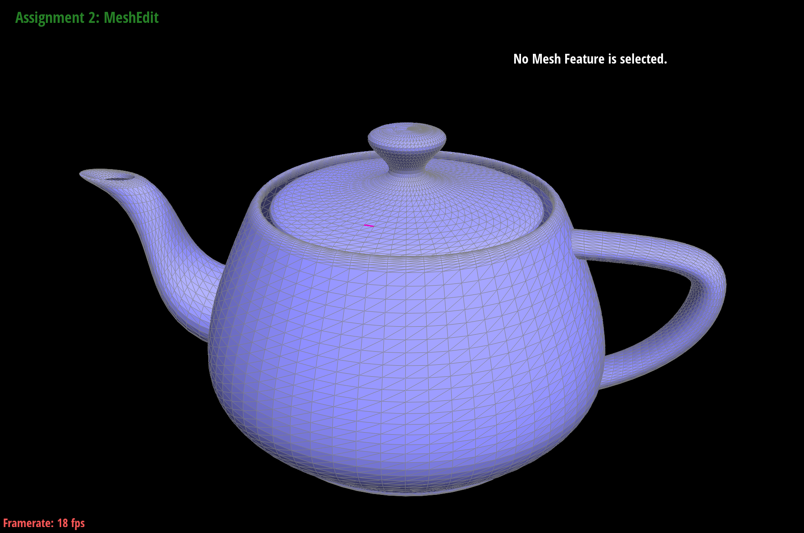

# Project 2

## Overview

In this project, we worked on creating Bezier curves and surfaces, and also implemented various operations on meshes. It was cool to see in practice how we create 3D objects, and how simple triangle meshes can be subdivided to make curved surfaces.

While working on the second half of the project, we found it hugely helpful to plan out and visualize the operations we were implementing. We also learned the importance of thoroughly testing smaller pieces of code before building on top of them. When working on loop subdivision, we discovered bugs in our edge flipping that caused our subdivision to enter infinite loops.

## Task 2

The de Casteljau algorithm can be extended to Bezier surfaces by finding the single point for every row of control points, and then finding the final point for the surface using all the calculated points. Essentially, you run the algorithm for every row of control points. This will give you a list of new points, which you can run the algorithm on once more to get the final, single point for the nxn surface.

## Task 3

We implemented area-weighted vertex normals by first collecting the neighbors of the vertex, then iterating over them to calculate the normal and area of each adjacent face. We calculated these using the cross product of the face edges, and the norm of the cross product, respectively. Then we summed the unit norms, weighted by the areas, and normalized the final result.

Below is a teapot with default flat shading, and with Phong shading.

## Task 4

For edge flip, we first drew out a simple mesh and labelled all the half-edges, vertices, edges, and faces in the mesh, shown below.

It was an extremely tedious process, but we first defined all the elements shown in the mesh illustration. Then, we reset all the pointers for each of the elements, such as the half-edges (set its next, twin, vertex, face, and edge), vertices, faces, and edges. 

As for debugging, we had a couple of typos that we had to debug through, simply by rereading the code and making sure it matched up with the illustration. 

## Task 5

Similar to edge flip, we also drew out a simple mesh for the operation, shown below.

This time, we had to create new elements (highlighted yellow above). After creating them, we assigned them all their necessary pointers. Similar to edge flip, we reassigned pointers to all elements in the mesh as well.

https://michelllepan.github.io/cs184-proj-webpage/