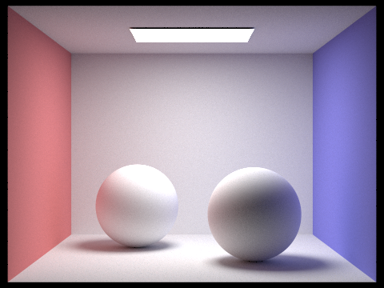
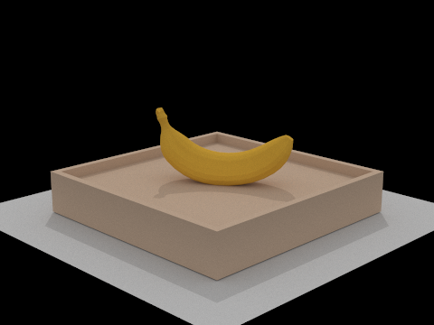
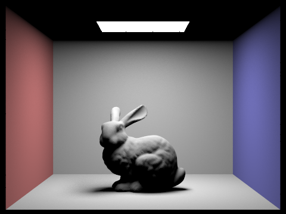
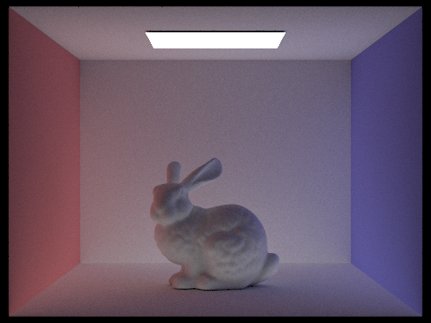
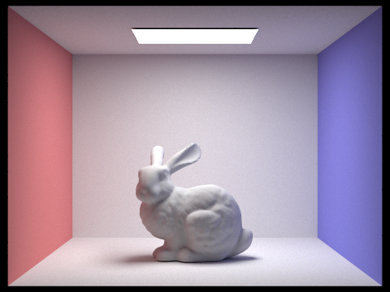

# Project 2

## Overview

## Part 1

## Part 2

## Part 3

## Part 4

For calculating more than one bounce of radiance, we needed to implement a function that calls the `one_bounce_radiance` function, and then recursively calls on itself to estimate higher bounces. To determine whether to continue recursing, we implement Russian Roulette where we terminate recursion with a probability of 0.2. We also must terminate if the bounces our ray takes exceeds the maximum depth defined as a parameter. 

In the recursive call, we call the `sample_f` function to give us a `pdf` for our L_out radiance function, as well as a `w_in` angle to use for the direction of our next bounce. We map the `w_in` angle to world coordinates and create a new ray in that direction, and see if it intersects any of our bounding boxes. If it does, then we recurse to find the additional radiance that we need to weight, normalize, and add to our total radiance.

Now that `at_least_one_bounce_radiance` has been implemented, we simply add this function to the returned radiance value in `est_radiance_global_illumination`.

### Images with global illumination

### Bunny with ONLY direct illumination and ONLY indirect illumination

### Bunny with different `max_ray_depth` values

`max_ray_depth = 0`

`max_ray_depth = 1`

`max_ray_depth = 2`

`max_ray_depth = 3`

`max_ray_depth = 100`

### Bunny with different sample-per-pixel values

1 sample per pixel

2 sample per pixel

4 sample per pixel

8 sample per pixel

16 sample per pixel

64 sample per pixel

1024 sample per pixel

## Part 5

Adaptive sampling tracks the convergence of pixels as we trace samples through it, which we use to stop sampling after reducing noise by a sufficient amount. This reduces samples for areas of the image that are relatively "simple" while allowing us to still sample more in the complex areas. We determine that a pixel has converged when the following condition is met:

$$1.96 \cdot \frac{\sigma}{\sqrt n} \leq \text{maxTolerance} \cdot \mu$$

where $n$ is the number of pixels and $\mu$ and $\sigma$ are the mean and standard deviation, respectively.

Our implementation of adaptive sampling uses the equations in Tip 2 to keep running sums of the sample illuminances and squared illuminances, and calculate the mean and variance from those. We add to the running sums after every sample, and check the convergence condition after every $\text{samplesPerBatch}$ samples. We also make sure to keep track of the actual number of samples taken if we stop sampling early in order to properly calculate our radiance estimate at the end.

Below are two scenes rendered with adaptive sampling, along with their sampling rate visualizations.

## Collaboration

https://michelllepan.github.io/cs184-proj-webpage/