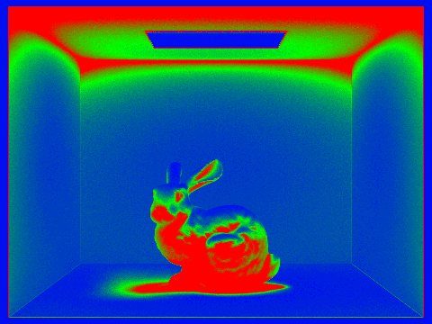
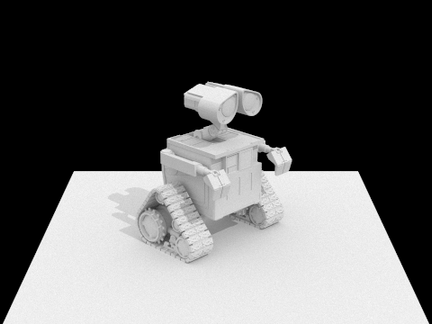
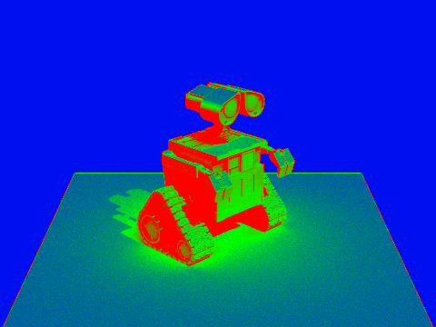

# Project 2

## Overview

## Part 1

## Part 2

## Part 3

## Part 4

## Part 5

Adaptive sampling tracks the convergence of pixels as we trace samples through it, which we use to stop sampling after reducing noise by a sufficient amount. This reduces samples for areas of the image that are relatively "simple" while allowing us to still sample more in the complex areas. We determine that a pixel has converged when the following condition is met:

$$1.96 \cdot \frac{\sigma}{\sqrt n} \leq \text{maxTolerance} \cdot \mu$$

where $n$ is the number of pixels and $\mu$ and $\sigma$ are the mean and standard deviation, respectively.

Our implementation of adaptive sampling uses the equations in Tip 2 to keep running sums of the sample illuminances and squared illuminances, and calculate the mean and variance from those. We add to the running sums after every sample, and check the convergence condition after every $\text{samplesPerBatch}$ samples. We also make sure to keep track of the actual number of samples taken if we stop sampling early in order to properly calculate our radiance estimate at the end.

Below are two scenes rendered with adaptive sampling, along with their sampling rate visualizations.

## Collaboration

https://michelllepan.github.io/cs184-proj-webpage/