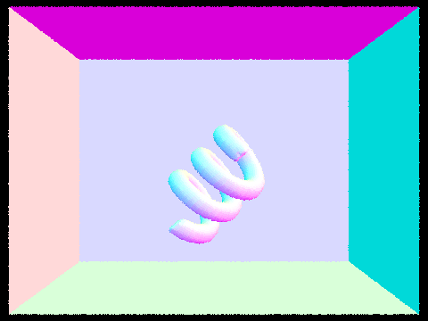
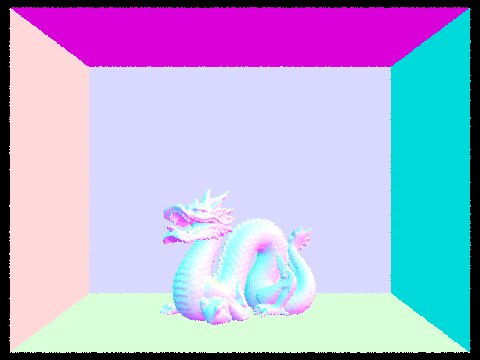

# Project 2

## Overview

In this project, we built a pathtracing renderer by implementing ray generation and intersection, bounding volume hierarchies, direct and global illumination, and adaptive sampling.

We started from rendering scenes using naive intersection methods and with colors based on the directions of the surface normals. By implementing BVHs, we were able to accelerate the intersection tests and render more complex scenes. We then integrated illumination to light up the scene based on the included light sources, and we saw how to improve our sampling to decrease noise in the scene. 

Overall, it was fascinating to apply the theory that we learned about ray tracing, radiometry and photometry, Monte Carlo integration, and global illumination in this project. It was also <i>illuminating</i> to see how much the performance improvements we implemented actually sped up our rendering and made a big difference in our images.

## Part 1

We generate a camera ray for coordinates in the image by transforming them to sensor coordinates in the camera space, generating a ray from the camera in that direction, and then transforming the ray into world space while accounting for the camera's position in the world. We generate random offsets within a pixel to sample multiple times and estimate the integral of the radiance over the pixel.

In our triangle intersection test, we use the Möller–Trumbore intersection algorithm. We first check if the ray is parallel to the triangle by comparing the ray's direction to the normal of the triangle plane. If their cross product is zero, the ray is parallel and the two will definitely not intersect. If not, we use the vector calculations of the algorithm to find the barycentric coordinates of the ray intersection on the plane, and check if the coordinates lie within the triangle. If the intersection is within the triangle, we then check that the `t` value lies within the min and max values for the ray, and set the intersection pointer info if it does. We also update the `max_t` value of the ray.

In our sphere intersection test, we use the ray and sphere equations to solve for potential intersections. We use the determinant of the resulting equation to check if there are valid solutions by testing whether it is nonnegative. We store the computed `t` values of potential intersections with the sphere, and then check to determine if they lie within the valid range for the ray. There is a possibility that the ray starts inside the sphere, in which only the larger `t` value would be an intersection. We again update the `max_t` value of the ray if there is indeed an intersection.

Below are some scenes rendered with normal shading.

## Part 2

Our BVH construction algorithm is pretty straightforward, and we use the simplest heuristic. We find the largest dimension to split on, and then split down the middle of that. We sort all the elements within the bounding box on our split dimension, and we simply set all the elements on the left as the left node bbox and all elements on the right as the right node bbox. There is a small edge case where there may not be elements on the left or right of the center we split on, so in this case we just take the left/rightmost element and put it in the corresponding node. 

### Examples rendered with BVH

### BVH rendering times

BVH acceleration heavily improves rendering times with complex geometries. For example, the human face statue went from 138.98s on a Macbook Pro to 0.54s, and the woman statue went from a whopping 328.40s to a mere 1.30s. These are incredible improvements, and can show how optimization can quickly improve runtime for these complex meshes.

## Part 3

Our implementation of the direct lighting function calculates the amount of light reflected to the camera from any point in the scene by first estimating the amount of light arriving there from a light source, then using the reflection equation to calculate outgoing light. We approximate the incoming light to a point in the scene using a Monte Carlo estimator, and take samples through two different methods.

The first method is uniform hemisphere sampling, in which we uniformly sample a direction from the hemisphere around any point on a surface and cast a ray. If the ray intersects a light source, we incorporate the incoming irradiance in our computation.

The second method is importance sampling, in which we directly sample points on the lights and cast rays on those directions. As with uniform hemisphere sampling, we check if the rays intersect the light sources (i.e. that they are not blocked by another object), and use them in our estimate if they do. We also make sure to only sample once for point lights to avoid extra computation.

Here are some comparisons between the two sampling methods (uniform hemisphere on the left, importance on the right):

Below is a scene rendered with 1 (upper left), 4 (upper right), 16 (lower left), and 64 (lower right) light rays using light sampling.

We can see that as we use more light rays, the noise in the soft shadows cast by the rabbit decreases. The difference is most noticeable in moving from 1 to 4 rays, and improves gradually as we further increase the number of rays.

In general, the results from light sampling have less noise than uniform hemisphere sampling. We notice that the noise in uniform hemisphere sampling occurs in the lighter areas of the scene, and the darker shadows are less affected. This makes sense because rays cast from the areas in shadows are unlikely to hit a light regardless, so the fact that rays cast in directions selected using uniform hemisphere sampling don't hit lits doesn't affect the rendering in those areas. However, for areas that are actually more lit up, there is variance in whether the rays in uniform hemisphere sampling find a light source, leading to noise. Light sampling does not result in this problem since rays are cast directly toward the lights in the scene.

## Part 4

For calculating more than one bounce of radiance, we needed to implement a function that calls the `one_bounce_radiance` function, and then recursively calls on itself to estimate higher bounces. To determine whether to continue recursing, we implement Russian Roulette where we terminate recursion with a probability of 0.2. We also must terminate if the bounces our ray takes exceeds the maximum depth defined as a parameter. 

In the recursive call, we call the `sample_f` function to give us a `pdf` for our L_out radiance function, as well as a `w_in` angle to use for the direction of our next bounce. We map the `w_in` angle to world coordinates and create a new ray in that direction, and see if it intersects any of our bounding boxes. If it does, then we recurse to find the additional radiance that we need to weight, normalize, and add to our total radiance.

Now that `at_least_one_bounce_radiance` has been implemented, we simply add this function to the returned radiance value in `est_radiance_global_illumination`.

### Images with global illumination

### Bunny with ONLY direct illumination and ONLY indirect illumination

### Bunny with different `max_ray_depth` values

`max_ray_depth = 0`

`max_ray_depth = 1`

`max_ray_depth = 2`

`max_ray_depth = 3`

`max_ray_depth = 100`

### Bunny with different sample-per-pixel values

1 sample per pixel

2 sample per pixel

4 sample per pixel

8 sample per pixel

16 sample per pixel

64 sample per pixel

1024 sample per pixel

## Part 5

Adaptive sampling tracks the convergence of pixels as we trace samples through it, which we use to stop sampling after reducing noise by a sufficient amount. This reduces samples for areas of the image that are relatively "simple" while allowing us to still sample more in the complex areas. We determine that a pixel has converged when the following condition is met:

$$1.96 \cdot \frac{\sigma}{\sqrt n} \leq \text{maxTolerance} \cdot \mu$$

where $n$ is the number of pixels and $\mu$ and $\sigma$ are the mean and standard deviation, respectively.

Our implementation of adaptive sampling uses the equations in Tip 2 to keep running sums of the sample illuminances and squared illuminances, and calculate the mean and variance from those. We add to the running sums after every sample, and check the convergence condition after every $\text{samplesPerBatch}$ samples. We also make sure to keep track of the actual number of samples taken if we stop sampling early in order to properly calculate our radiance estimate at the end.

Below are two scenes rendered with adaptive sampling, along with their sampling rate visualizations.

## Collaboration

Throughout collaborating on this project, we tried to work on most parts together by pair programming. We found that this helped us spot each other's errors and allowed us to work together to understand the concepts from lecture and figure out how to translate them to code. When we couldn't find time to do this, we also split up sections to do separately and would combine them together later, although this sometimes made debugging harder. 

Having a partner to work with made the debugging process faster and a bit easier since we could look at different parts of the code to see what might be going wrong, and we could bounce ideas off of each other too.

https://michelllepan.github.io/cs184-proj-webpage/