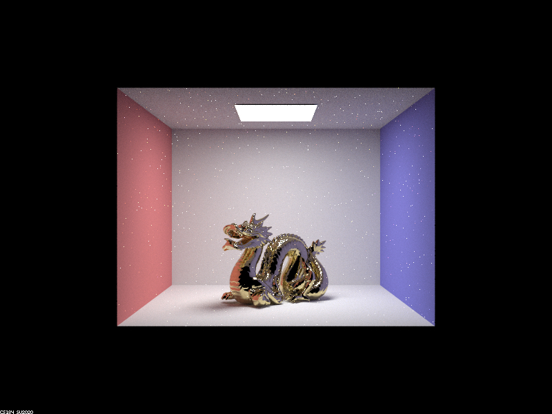
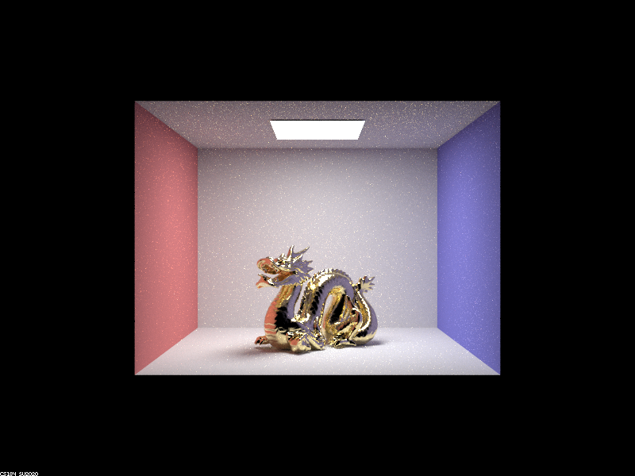
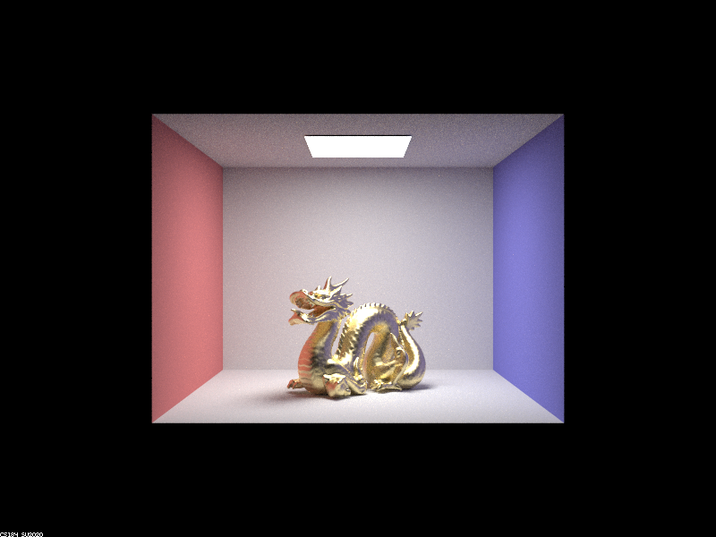
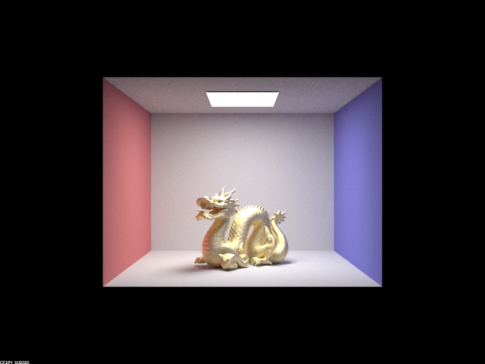
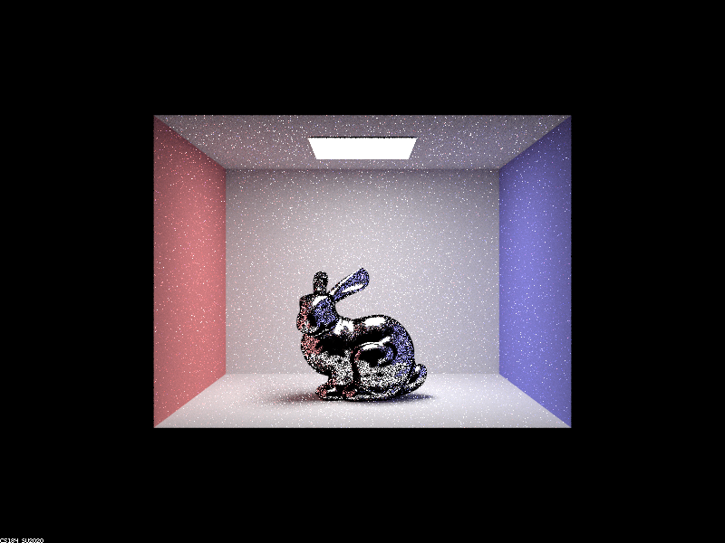
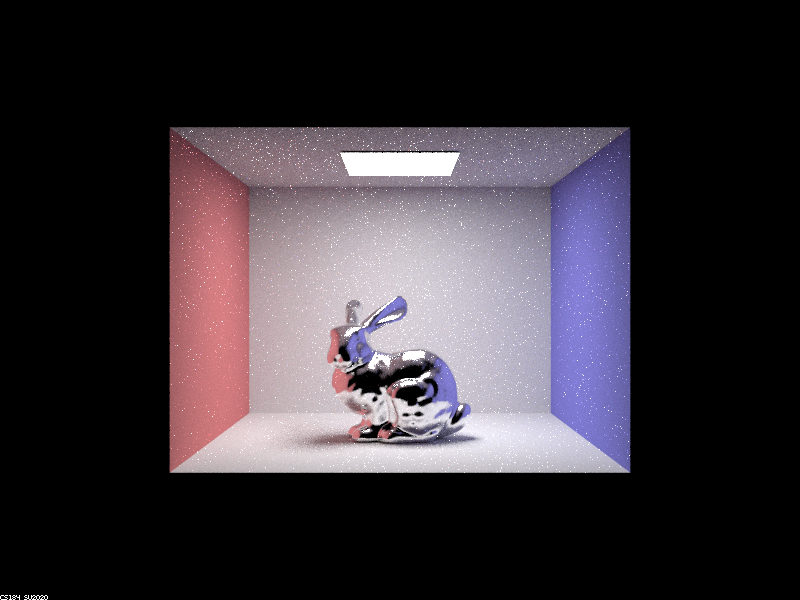

# Project 3-2

## Overview


## Part 2

### `alpha` values

With 128 samples per pixel, 4 samples per light, and 7 bounces:



`alpha = 0.005`



`alpha = 0.05`



`alpha = 0.25`



`alpha = 0.5`

Alpha is a value that sets the “roughness” of the macro surface, where the lower the value, the larger the distribution will be and the glossier/more reflective the surface is. The higher the value, the surface becomes more diffuse and less smooth.

### Cosine hemisphere sampling vs. Importance Sampling

With 64 samples per pixel, 1 sample per light, and 7 bounces:




With cosine hemisphere sampling (first image), it samples uniformly which gives a much noisier result within the bunny statue than importance sampling (second image). This is because importance sampling distributes samples according to light (allowing more samples on the bunny) which produces better and clearer images.


### Changing material

The new conductor material we are using is silver, and these are the value properties: 

```
Vector3D eta = Vector3D(0.0592, 0.059881, 0.047366);
Vector3D k = Vector3D(4.128, 3.5892, 2.8132);
```


## Part 4

<3 ily michelle

https://michelllepan.github.io/cs184-proj-webpage/