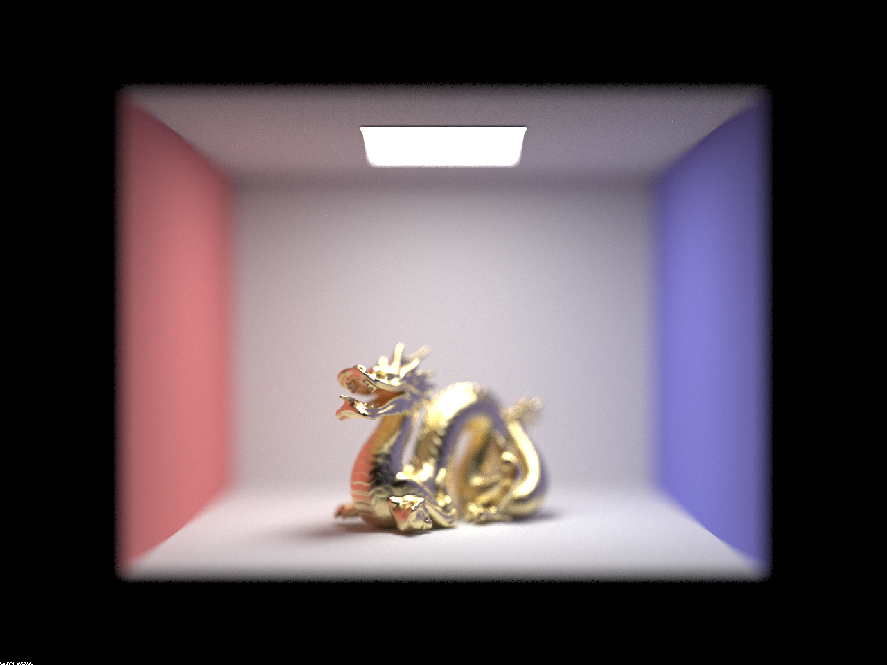
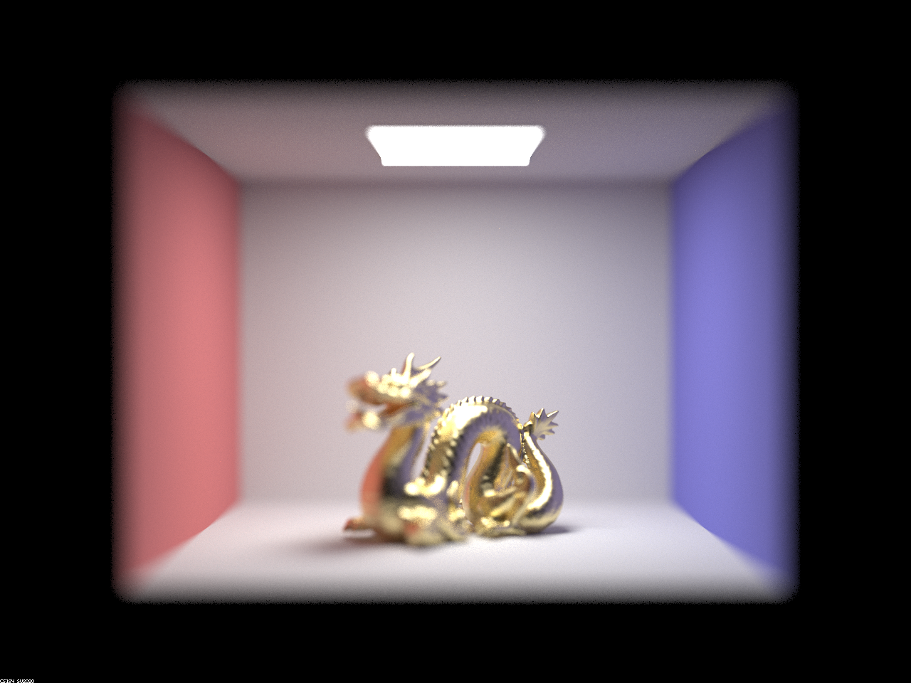
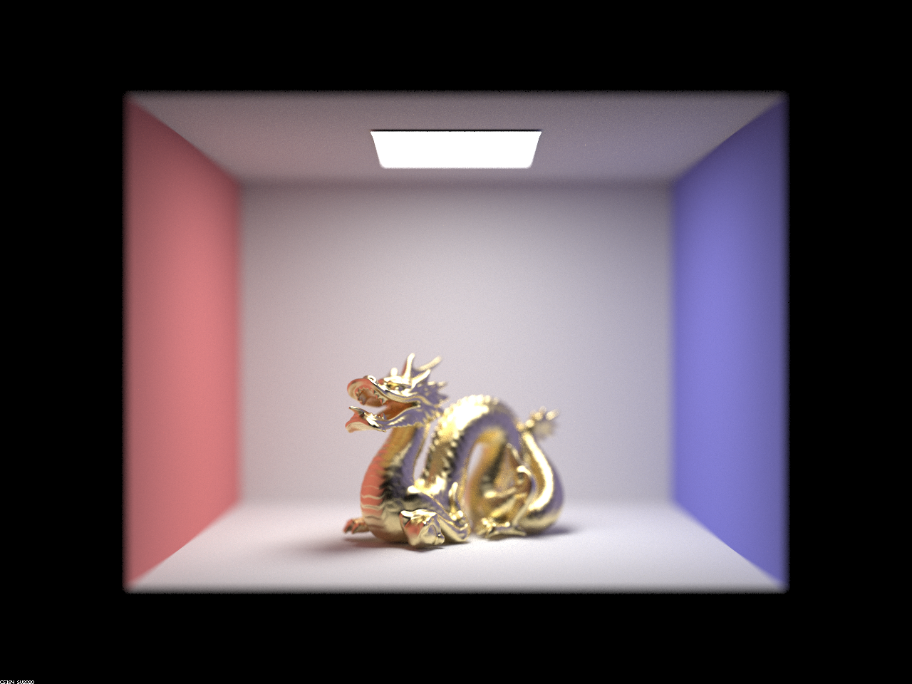
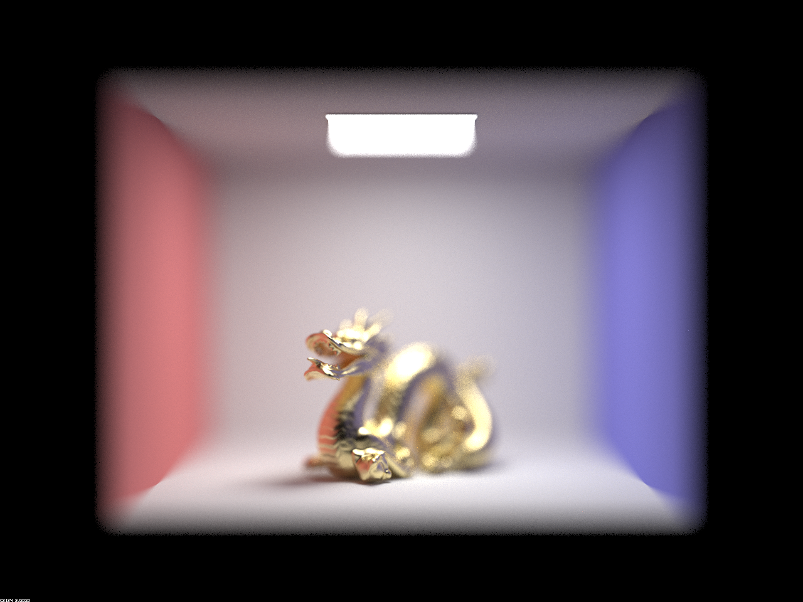

# Project 3-2

## Overview

In this project, we implemented rendering of microfacet materials and depth of field. We found it cool to be able to add these visual effects to our rendering, which contributed an extra level of photorealism. We found it particularly interesting to see how the effects built on top of each other, and on top of what was implemented in project 3-1.

## Part 2

### `alpha` values

With 128 samples per pixel, 4 samples per light, and 7 bounces:

`alpha = 0.005`


`alpha = 0.05`


`alpha = 0.25`


`alpha = 0.5`


Alpha is a value that sets the “roughness” of the macro surface, where the lower the value, the larger the distribution will be and the glossier/more reflective the surface is. The higher the value, the surface becomes more diffuse and less smooth.

### Cosine hemisphere sampling vs. Importance Sampling

With 64 samples per pixel, 1 sample per light, and 7 bounces:


With cosine hemisphere sampling (first image), it samples uniformly which gives a much noisier result within the bunny statue than importance sampling (second image). This is because importance sampling distributes samples according to light (allowing more samples on the bunny) which produces better and clearer images.


### Changing material

The new conductor material we are using is silver, and these are the value properties: 

```
Vector3D eta = Vector3D(0.0592, 0.059881, 0.047366);
Vector3D k = Vector3D(4.128, 3.5892, 2.8132);
```


## Part 4

In a pinhole camera model, everything in the image is focus, and each point in the image only receives radiance from the single point of the pinhole. In a thin lens camera model, each point in the image receives radiance from across the lens, which results in focus in the scene at only the focal distance.

We implemented depth of field by writing a new function that would generate rays originating from a randomly sampled point on the lens, pointing towards a point on the plane of focus. This point was found by looking at the ray from the sensor coordinates to the center of the lens, and calculating where it intersected the plane of focus.

### Focus stack

Below are renderings of the same scene, focused at different points.

`focal distance = 4.25`


`focal distance = 4.50`



`focal distance = 4.75`


`focal distance = 5.00`



### Aperture

Below are renderings of the same scene, focused at the same point but with different aperture sizes.

`aperture = 1.3`



`aperture = 2.3`


`aperture = 3.3`


`aperture = 4.3`



## Collaboration

Our collaboration on this project went quite smoothly, with us sitting down to implement some parts together and splitting up the work for others. It was quite helpful to be able to debug together and bounce ideas off each other when we were stuck in the process. Throughout debugging, we learned to careful when translating formulas to code, since making small mistakes there would break our code later on and be hard to find.

https://michelllepan.github.io/cs184-proj-webpage/