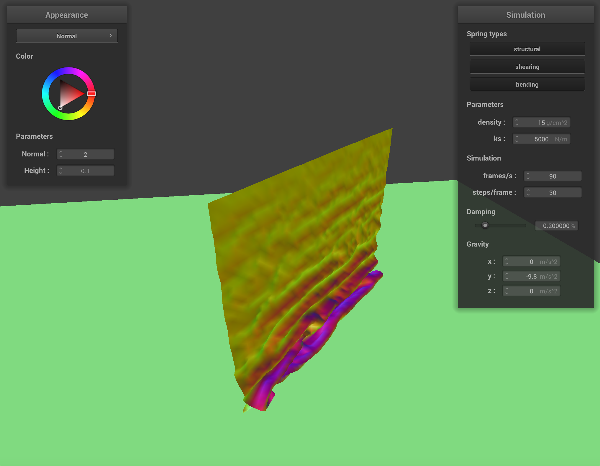
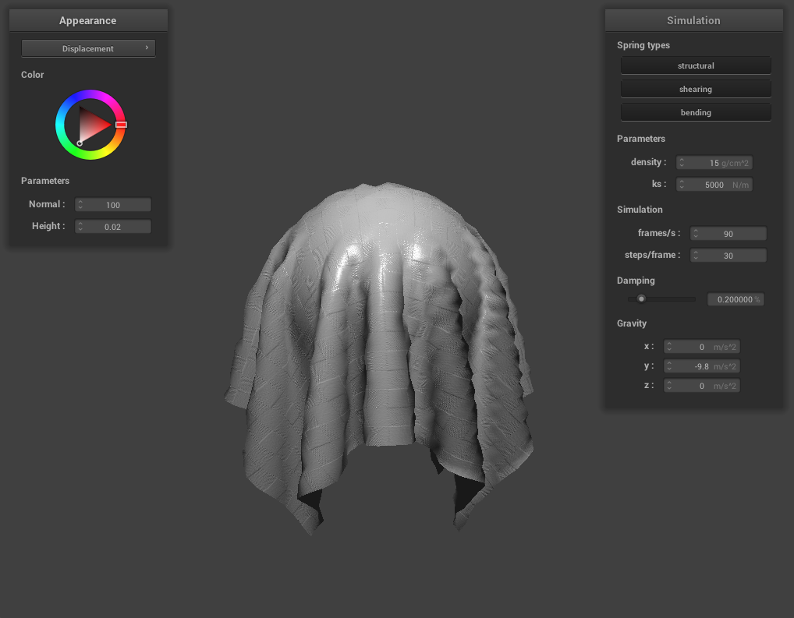
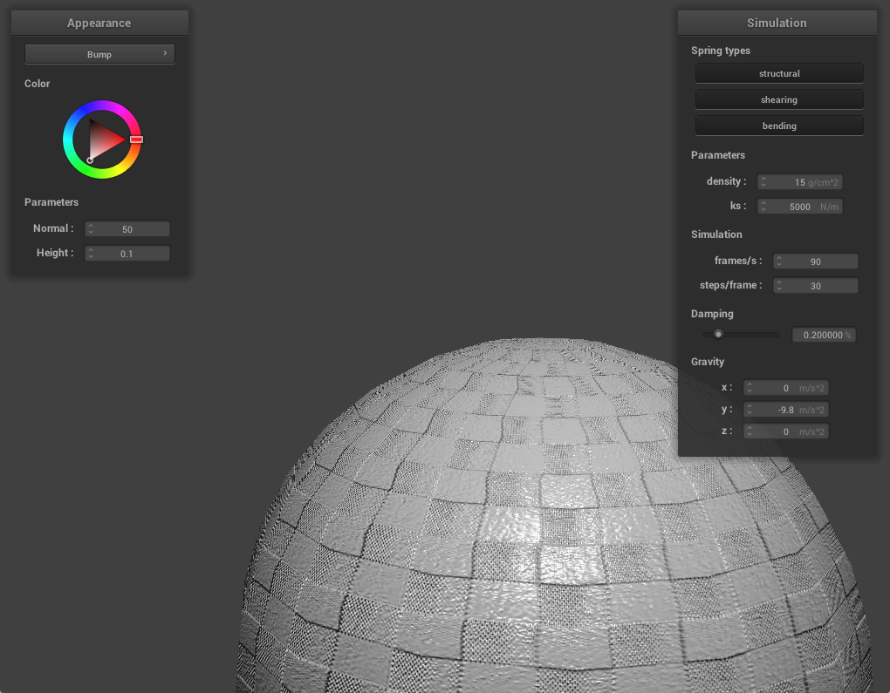

# Project 4

## Overview

In this project we implemented a cloth simulator using a mass and spring system. We started by building out our cloth representation using point masses and springs to represent various constraints. We then simulated movement of the cloth by calculating forces applied and using Verlet integration to update the point positions. We handled collisions, both between the cloth and other objects as well as of the cloth with itself. Finally, we implemented a variety of shaders (diffuse, Blinn-Phong, textures, bump and displacement mapping, and mirrors) to change the appearance of our cloth.

Overall this project was quite enjoyable, and even when we were debugging our code we got to see many funny bugs where our cloth moved in ways we had never imagined before. It was interesting to play around with the various simulation parameters and see how they affected the way the cloth moved.

## Part 1

In building our grid of masses and springs, we first added all the masses by spacing out the points along the given width and height. We assigned coordinates to the masses and chose which axes to vary the values on based on the orientation of the cloth. One bug we dealt with was in calculating the z coordinate for a vertical cloth, since we assumed that `rand()` returned values from 0 to 1 and didn't realize that we needed to divide by `RAND_MAX`.

After creating the point masses, we iterated through each point and added springs connecting to other points for structural, shearing, and bending constraints. We made sure that we only constructed each spring once by creating the spring when we were iterating through its lower/rightmost point.

Here is a rendering of our `scene/pinned2.json` with all constraints:

Here is a rendering of our `scene/pinned2.json` without shearing constraints:

Here is a rendering of our `scene/pinned2.json` with only shearing constraints:

## Part 2

To simulate the cloth movement, we started by calculating the external forces on the cloth by aggregating the external accelerations multiplied by the point masses, and applying this force to all the points. We also calculated the spring correction forces for all the springs, taking into account what type each of the springs were.

Then, we used Verlet integration with damping to update the positions of each non-pinned point mass at the next timestep, using information about the point's current and past position as well as the acceleration of the point. Finally, we constrained the point masses' positions to prevent the spring from stretching past 10% greater than its rest length, again making sure to only change the position of points that are not pinned.

Next we explore the effects of some of the simulation parameters. For reference, here is a screenshot of `scene/pinned2.json` at its resting state with the default parameters `ks = 5000 N/m`, `density = 15 g/cm^2`, and `damping = 0.2%`.

### `ks`

Changing the spring constant affects how much the cloth stretches. When the spring constant is decreased, it bounces more as it reaches the end of its fall and is pulled down further, showing some smaller wrinkles in the fabric. With a larger spring constant, the cloth becomes more stiff.

Below are images of `ks = 50 N/m` (left) and `ks = 50000 N/m` (right).

### `density`

Adjusting the density affects how "light" or "heavy" the cloth feels as it falls. As the density increases, we see that it folds down further as it is pulled by gravity.

Below are images of `density = 1 g/cm^2` (left) and `density = 100 g/cm^2` (right).

### `damping`

The damping parameter controls how much fo the energy from the springs is lost. With a lower damping constant, the cloth bounces around for a lot longer after it falls. When the damping constant is increased, the cloth falls very slowly into the final position.

Below are images of `damping = 0.034%` (left) and `damping = 0.770%` (right).

Here is a screenshot of our `scene/pinned4.json` in its final resting state:

## Part 3

In this part we implemented collision handling between our cloth and other objects, namely spheres and planes.

We handle collisions for each point mass individually. If the point mass has crossed to be inside an object, we calculate a correction vector to adjust the mass back to where it would have intersected the object. We then scale down the correction by a friction constant and apply it to the mass's position. 

These collisions are handled for every step of our simulation, by looping through all the objects in the scene for every point mass.

Below are results of our cloth in `scene/sphere.json` with varying spring constants. We see that smaller spring constants make the cloth more stretchy and allow it to be pulled down further by gravity, whereas larger values result in a stiffer cloth.

`ks = 500`

`ks = 5000`

`ks = 50000`

Here is a screenshot of our cloth lying peacefully at rest on the plane:

## Part 4

Currently, our cloth will clip through itself upon self-collision. In part 4, we will efficiently implement self-collision using spatial hashing.

To implement the spatial map, we loop through all the point masses and hash their position. This position is a unique float identifier that represents the top left corner of a 3D box volume that a point occupies, and we used a polynomial to create a float from the x, y, and z coordinates. 

Now that we have a spatial hash map we can refer to, for every timestep we loop through every point and check to see if it will collide with another point on the cloth. We do this by hashing the point to check if any other points are within the 3D box volume. If there are, we need to determine whether they are 2 * thickness apart, and if so, we compute and apply a correction vector to the point mass. 

For part 4, our approach was to write the hash function, the spatial map, and then the self collision code. We had some bugs when implementing — the cloth was not rendering correctly in the first place, so we had to go back to previous parts and fix our code dealing with vertical cloths. Then, our cloth was still clipping on itself, and we realized that we were not initializing our spatial hash map properly. Once we fixed these mistakes, our cloth was successfully self-colliding with itself.

Here are some screenshots of the cloth falling on itself:

When varying the Ks values, a very low Ks value (ks = 10 N/m) makes the cloth very bouncy where you can almost see individual vectors and pieces of the cloth bouncing on itself. It also begins to unravel itself very quickly because of this, and does not come to rest easily. A higher Ks value (ks = 10000 N/m) creates a less springy, much smoother and stiffer cloth that easily comes to rest.

When density is low (15 g/cm^2), the cloth feels very light and has very curvy bends when it folds over itself. It almost looks like a sheet of paper. However, when density is higher (150 g/cm^2), the cloth feels a lot heavier and looks more like a piece of clothing. It forms a lot of small bends when it folds over itself.

## Part 5

A shader program is a program that runs in parallel on the GPU. They take in an input and output a single 4D vector and help execute sections of the graphics pipeline to accelerate the raytracing process. The two shader types we deal with in this part of the project are vertex and fragment shaders. Vertex shaders help apply transforms to vertices, which help us write displacement mapping. Fragment shaders take in geometric attributes of a fragment to compute a color. Together, these two shaders work to create realistic lighting and material effects by calculating the interaction of light with the surfaces of 3D objects.

Our approach was to understand how to write the GLSL language by reviewing documentation and a couple examples. We then wrote and debugged each approach.

The first shading we implemented was diffuse shading, which was a simple equation we had to output. Then, in Blinn-Phong shading, we added ambient and specular lighting to the diffuse component. All these different types of light allow the cloth to reflect light more accurately, which are represented in the Blinn-Phong model. The implementation was a bit tricky, especially for specular shading. We fixed a lot of our bugs by normalizing our vectors and reviewing the diagrams in class to make sure we were utilizing the right vectors and values.

Below, we have screenshots representing only the ambient component, diffuse component, and the specular component.

We then implemented texture mapping. This was a fairly easy implementation, as all we needed to do was call the built-in function to sample from a texture at texture space uv.

For the bump mapping implementation, we needed to factor in the height of the texture to output the right color. This was done by calculating a TBN (tangent-bitangent-normal) matrix which we multiplied to find the displaced model space normal, which was substituted into our diffuse and specular lighting to create a “bump” textured effect. For displacement mapping, we needed to actually alter the vertices for the cloth in the .vert file. 

Here are screenshots of our bump mapping on the sphere and cloth:

Here are screenshots of our displacement mapping on the sphere and cloth:

We can observe a noticeable difference in bump and displacement mapping as the vertex positions are not actually affected in bump mapping, so we don't see the effects of shadows in the geometry of the mesh.

At a low coarseness, there is not too much difference between bump and displacement mapping. However, at a higher coarseness, the displacement mapping is a lot more accurate (e.g. we can see the cracks in the bricks) and something we might want to use in actual simulations.

High coarseness for bump (left) and displacement (right) mapping:

Low coarseness for bump (left) and displacement (right) mapping:

Last but not least, we created a mirror shader that can sample an incoming radiance. It reflects an environment map with the cloth, as shown below.

https://michelllepan.github.io/cs184-proj-webpage/